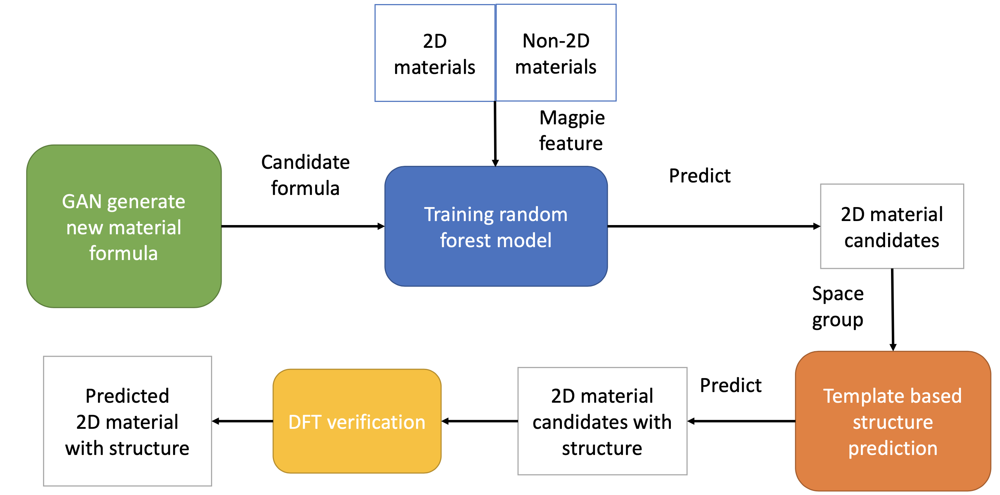

# Hypothetical 2D Materials (composition) Database
#### by Dr. Jianjun Hu

## Manual

### Background 
Two dimensional materials such as graphene and hexagonal boron nitride have the potential to create new electronics and technologies such as spintronics, catalysis, and membranes owing to their exotic vibrational, electronic, optical, magnetic, and topological behaviors. Although several thousand 2D materials have been screened in existing materials databases, discovering new 2D materials remains challenging. Here, we used a random forest-based 2D materials classifier [^1] to discover new hypothetical 2D materials.

### The database generation Method

We trained a machine learning model for classifying a given compositio into 2D or non-2D materials [^1]. We then apply this model to the 3 Million hypothetical materials compositions generated by the MATGAN algorithm as described in [^2]. 

### The basic idea

_Figure 1: Framework for generation and prediction of 2D materials._

<!--  -->

  

The basic idea of this 2D materials discovery method includes four modules: a GAN-based hypothetical materials generator, a composition-based 2D materials classifier, a template-based structure predictor, and a DFT confirmation procedure. The hypothetical materials generator (MATGAN) is trained with known inorganic materials in the Materials Project database to learn the composition rules of forming stable chemically valid materials compositions [^2]. Then, we use the generative module to breed a large number of hypothetical formulas (two million samples). These formulas are then subjected to chemical validity tests including charge neutrality check and electronegativity check. After that, the remaining samples will be screened by the 2D materials classifier using composition alone. To verify the predicted 2D materials compositions, we apply template based element substitution to generate their hypothetical structures for a subset of 624 predicted 2D materials compositions. Using DFT calculations, the stability of these structures is calculated to verify the existence of these candidate 2D materials from which we identified twelve potentially stable materials.

#### the 2D materials machine learning classifier: How it works

### Performance and Limitations

Please note that the compositions in this databse is hypothetical and have no guarantee for its synthesizability of structural stablity. 

### Using the Database Search function

#### Entering Inputs

Practically, the procedure for getting predictions consists in 3 steps

1. Pick elements: Select on the periodic table what constituent elements comprise the chemical space you are interested in.
   For instance if you want to make predictions for battery materials based on Li, Mn and O, you should pick those three elements.
2. After the results are returned, you can further narrow down the search by typing in the top right input box with more specific partial formula, e.g. Li2
3. Interpret the results.
   

#### Interpreting the Results

The results pages provides a set of potential 2D materials compositions as recommended by our 2D materials classifier. 

### Future features

In the future, we want to generate more 2D materials candidates and also possibly predict their crystal structures using our crystal structure prediction algorithm.s

### Citations

To cite the Structure Predictor App, please reference the following works:

- Song, Y., Siriwardane, E. M. D., Zhao, Y., & Hu, J. (2021). Computational discovery of new 2D materials using deep learning generative models. ACS Applied Materials & Interfaces.
- Hu, J., Stefanov, S., Song, Y., Omee, S. S., Louis, S. Y., Siriwardane, E., & Zhao, Y. (2021). MaterialsAtlas. org: A Materials Informatics Web App Platform for Materials Discovery and Survey of State-of-the-Art. arXiv preprint arXiv:2109.04007.

[^1]: Song, Y., Siriwardane, E. M. D., Zhao, Y., & Hu, J. (2021). Computational discovery of new 2D materials using deep learning generative models. ACS Applied Materials & Interfaces.
[^2]: Dan, Y., Zhao, Y., Li, X., Li, S., Hu, M., & Hu, J. (2020). Generative adversarial networks (GAN) based efficient sampling of chemical composition space for inverse design of inorganic materials. npj Computational Materials, 6(1), 1-7.

### Authors

- Jianjun HU
- Yuqi Song
